# Gank.UWP

## 简介👇

> **干货集中营**  
> 每日分享妹子图 和 技术干货，还有供大家中午休息的休闲视频

❣Gank.UWP为 [gank.io](http://gank.io/) 的**UWP**版第三方客户端。 
每个工作日提供技术干货和妹子图。  
🙄*遗憾的是[gank.io](http://gank.io/)并未收集UWP开发甚至.NET相关的干货。* 

🤓**已发布到Windows应用商店，[点击下载](https://www.microsoft.com/store/apps/9nblggh412kz)。**

😇*因WP平台已近死，未对WP进行测试。但既然是UWP，不出意外也可于手机上运行。* 

## 功能🎡

### 每日视图📆

 主视图为每日视图，均支持三种尺寸窗口的适配。 

 可选择日期查看和提交干货。

 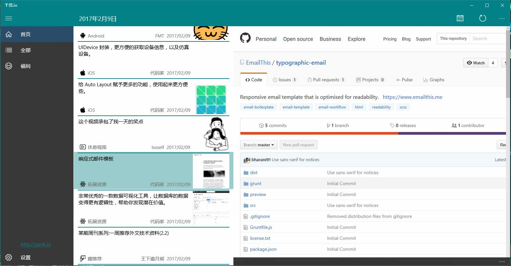
 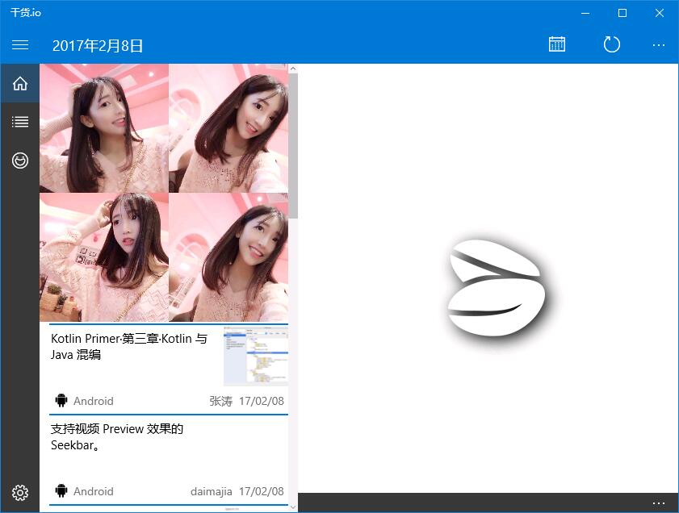
 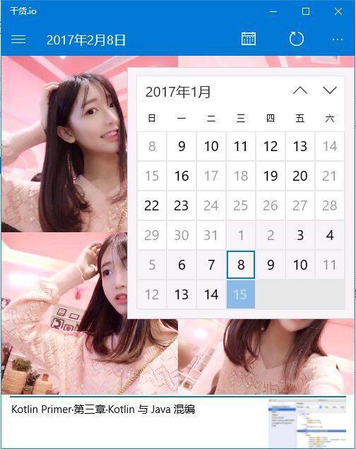

 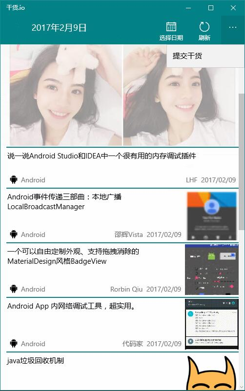

### 分类干货🍪

 可分类查看所有干货。

 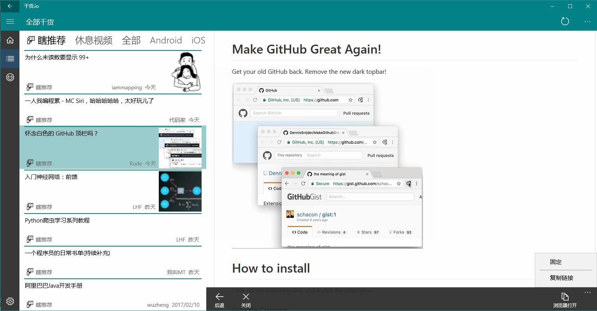

### 福利视图🙎

 查看所有福利。可保存图片或发送到磁贴。

 
 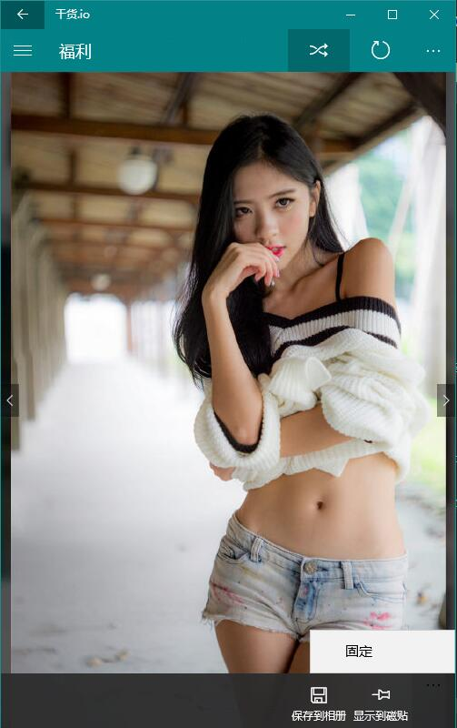   
 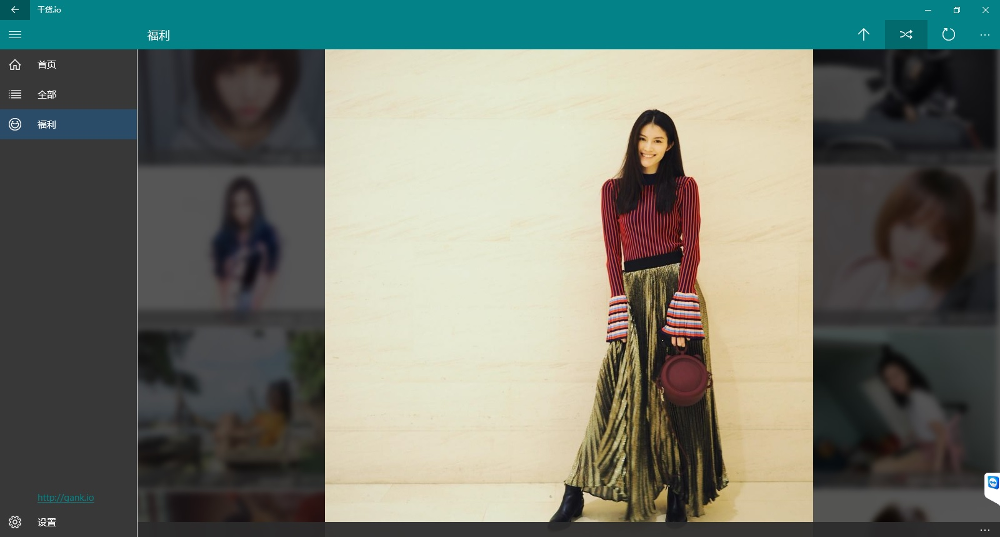

### Win10相关💻

- 通知

  每日更新通知，用户操作时或每两小时进行检查，*非推送*。

  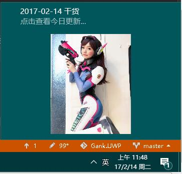

- 磁贴

  多种尺寸的磁贴显示。

  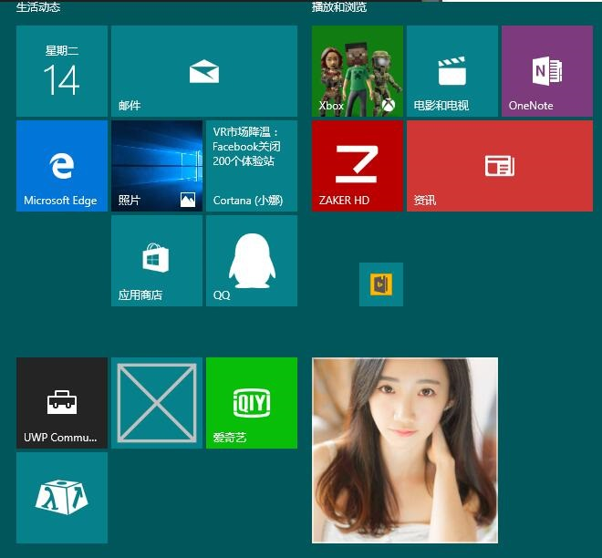 

   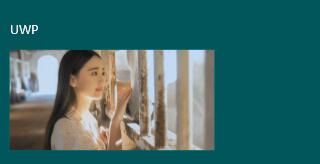 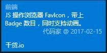  

- 小娜

  可对小娜说出“在干货里来些福利”或“在干货里来些文章”打开到指定页面。

  后期会对此功能进行优化和完善。

## 使用框架🗡

开发中涉及的类库主要包括：
- [Template10](https://github.com/Windows-XAML/Template10)
- [UWPCommunityToolkit](https://github.com/Microsoft/UWPCommunityToolkit)
- [Json.NET](http://www.newtonsoft.com/json)

